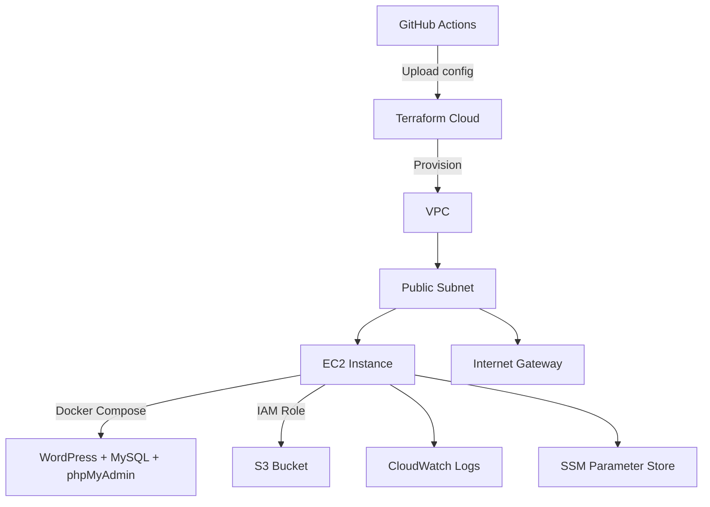

# WordPress AWS Infrastructure with Terraform  

This project provisions AWS infrastructure for a Docker-based WordPress setup using **Terraform** and deploys it via **GitHub Actions** CI/CD.  

---

## 📦 Infrastructure Overview  

- **Infrastructure as Code** using Terraform  
- **AWS Resources**:  
  - **VPC** (public subnet, internet gateway, route table)  
  - **EC2 Instance** (Amazon Linux 2, Docker, Docker Compose)  
  - **IAM Role** (S3 access) + Instance Profile  
  - **S3 Bucket** (for WordPress storage)  
  - **CloudWatch Logs**  
  - **SSM Parameter Store** (to securely store WordPress credentials)  
- **Docker Compose Services**:  
  - WordPress (PHP + Apache)  
  - MySQL  
  - phpMyAdmin  

---

## 🗺️ Architecture Diagram  



---

## ⚙️ Deployment Flow  

1. **Push to `master` branch**  
2. **GitHub Actions** uploads Terraform configuration to Terraform Cloud  
3. **Manual approval** in Terraform Cloud console to run `terraform apply`  

---

## 🔑 Terraform Credentials for CI/CD  

To allow GitHub Actions to deploy AWS infrastructure via Terraform, you need to configure the following **GitHub Environment Variables** and **Secrets**.  

### **GitHub Environment Variables** (set under your `Production` environment)  
- `TF_CLOUD_WORKSPACE` – The name of your Terraform Cloud workspace  
- `TF_WORKING_DIRECTORY` – Path to your Terraform configuration (e.g., `./infra-terraform`)  

### **GitHub Secrets**  
- `TF_CLOUD_TOKEN_APP_TERRAFORM_IO` – Terraform Cloud API token  

**Where to set them**:  
```
GitHub Repo → Settings → Secrets and variables → Actions
```

---

### 🚀 Manual Apply in Terraform Cloud  

The CI/CD workflow will **upload** the configuration to **Terraform Cloud**, but **you must manually apply it**:  

1. Go to **Terraform Cloud Dashboard**  
2. Open your workspace (`TF_CLOUD_WORKSPACE`)  
3. Find the pending run  
4. Click **Confirm & Apply** to deploy  

---

## 🛠️ Prerequisites  

- Terraform CLI v1.8+  
- Terraform Cloud account  
- AWS account with access to create VPC, EC2, S3, IAM, and CloudWatch resources  
- GitHub repository with Actions enabled  

---

## 📂 Project Structure  

```
.
├── infra-terraform/   # Terraform configuration
├── wordpress/         # Wordpress Source Code
├── docker-compose.yml # WordPress + MySQL + phpMyAdmin setup
├── README.md          # Documentation
└── .github/workflows/ # GitHub Actions workflow
```

---

## 📝 Notes  

- EC2 instance uses **AWS SSM Session Manager** instead of SSH keys  
- WordPress username and password are stored in **AWS SSM Parameter Store**  
- phpMyAdmin accessible via the same EC2 public IP on port `8080` (if exposed in docker-compose)  
